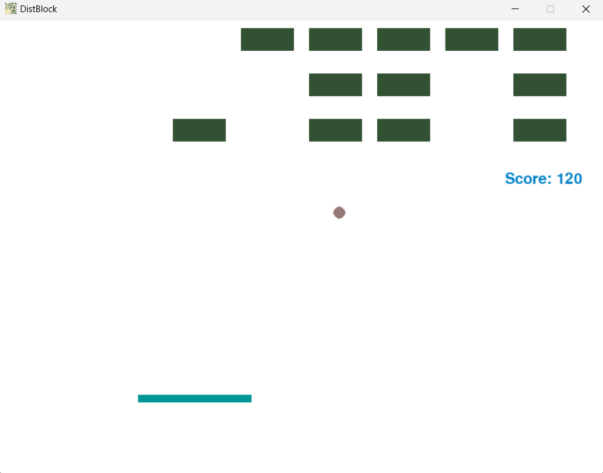

# Block Breaker Game

## Overview

This project is a classic block-breaking game created using Pygame. It is an ideal project for learning basic game development skills in Python.

## Gameplay

- Use the ball to hit and break the blocks located at the top of the screen to earn points.
- Move the paddle left (A key) or right (D key) to bounce the ball.
- If the ball touches the floor, points will be deducted.

## Getting Started

1. Install Python: [https://www.python.org/](https://www.python.org/)
2. Install the necessary Pygame library:

```
pip install pygame
```

3. Clone the repository and run the main game file:

```
git clone https://github.com/ReoF777/PingPo
cd PingPo
python main.py
```



## Controls

- A key: Move the paddle to the left.
- D key: Move the paddle to the right.

## Scoring System

- Points are awarded for breaking blocks.
- Points are deducted when the ball touches the floor.

## License

This project is released under the MIT License.
